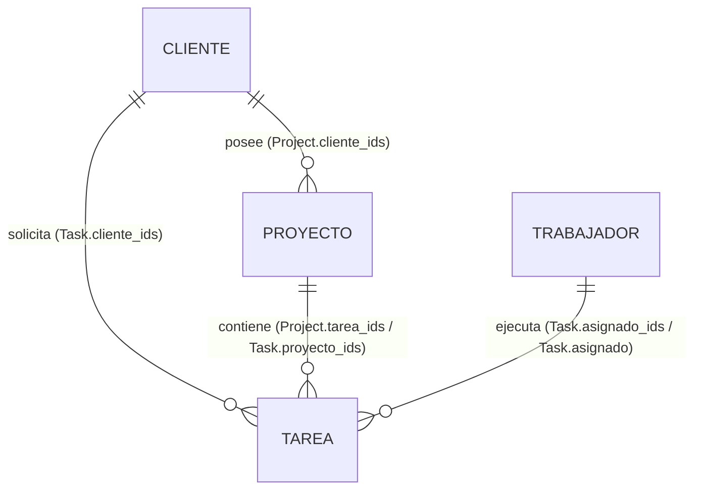

# Inventario y Auditoría del Modelo de Datos (Braindex / Taski)

> **Nota para la IA y Desarrolladores**: Este documento es la fuente de verdad del modelo de datos actual. **Antes de implementar cualquier feature que agregue, elimine o modifique propiedades o relaciones de datos, consulta este archivo y actualízalo.**

---

## 1. Arquitectura General y Almacenamiento en Firestore

1. **Colecciones Nativas Definitivas (Nivel Producción - Activo)**
   - Un documento de Firestore por registro en colecciones relacionales independientes:
     - `/clients/{clientId}` (31 registros)
     - `/workers/{workerId}` (7 registros)
     - `/projects/{projectId}` (28 registros activos, 2 excluidos de prueba)
     - `/tasks/{taskId}` (297 registros activos, 3 excluidas de prueba)
   - **Status**: **FUENTE DE VERDAD OFICIAL**. Todas las nuevas features y lecturas se construyen sobre este esquema.

2. **Sistema Legacy A (`notion_cache`) [DEPRECATED — RESPALDO SOLO LECTURA]**
   - Respaldo estático mantenido por seguridad. No utilizar para nuevas operaciones de escritura ni nuevos componentes.

3. **Sistema Legacy B (`v3_*`) [DEPRECATED — RESPALDO SOLO LECTURA]**
   - Respaldo estático del canvas local. No utilizar para nuevas operaciones.

---

## 2. Diagrama de Relaciones de Entidades

---

## 3. Inventario por Entidad

---

### A. Tarea (`Task`)

#### 1. Propiedades actuales
| Propiedad | Tipo | Requerida / Opcional | Descripción / Valores permitidos |
|---|---|---|---|
| `id` | `string` | Requerida | Identificador único (UUID) |
| `titulo` | `string` | Requerida | Nombre / Título / Idea principal de la tarea |
| `estado` | `string` | Requerida | Estado actual (`"Sin empezar"`, `"Pendiente"`, `"En curso"`, `"En Proceso"`, `"En revisión"`, `"Hecho"`, `"Completado"`) |
| `area` | `string` | Requerida | Área de especialidad (`"Social Media"`, `"Video"`, `"Diseño"`, `"Branding"`) |
| `asignado` | `string` | Requerida | **[Campo duplicado]** Nombre en texto del trabajador asignado |
| `asignado_ids` | `string[]` | Requerida | Arreglo de IDs del trabajador asignado (`Worker.id`) |
| `formato` | `string` | Requerida | Identificador/nombre del formato (`"Reel"`, `"Story"`, `"Post Imagen"`, `"Carrusel"`, `"Video"`, etc.) |
| `esfuerzo` | `string` | Requerida | Estimación de tiempo o carga de trabajo (`"Bajo"`, `"Medio"`, `"Alto"`, `"1h"`, `"2h"`, `"15 min"`) |
| `prioridad` | `string` | Requerida | Prioridad de ejecución (`"Alta"`, `"Media"`, `"Baja"`, `"MODERADO"`) |
| `plataformas` | `string[]` | Requerida | Redes/plataformas destino (`["Instagram", "TikTok", "Facebook", "Web"]`) |
| `contenido` | `string` | Requerida | Descripción detallada, guion o briefing del contenido |
| `copy` | `string` | Requerida | Texto o copy preparado para publicar |
| `adminNotes` | `string` | Requerida | Notas internas para supervisión administrativa |
| `notasCliente` | `string` | Requerida | Comentarios o revisiones dejadas por el cliente |
| `tiempoRealMins`| `number` | Opcional | Minutos reales registrados en cronómetro (Maker Mode) |
| `fechaProg` | `string` | Requerida | Fecha de programación ISO/string (`YYYY-MM-DD`) |
| `fechaEntrega` | `string` | Requerida | Fecha límite de entrega ISO/string (`YYYY-MM-DD`) |
| `proyecto_ids` | `string[]` | Requerida | IDs de proyectos vinculados (`Project.id`) |
| `cliente_ids` | `string[]` | Requerida | IDs de clientes vinculados (`Client.id`) |
| `created` | `string` | Requerida | Timestamp ISO de creación |
| `url` | `string` | Requerida | URL de la página origen en Notion |
| `color` | `string` | Opcional | Estilo de color personalizado para tarjetas Kanban |
| `kanbanOrders` | `Record<string, number>` | Opcional | **[Local Canvas]** Orden secuencial en columnas Kanban |
| `subtasks` | `{ id: number; text: string; done: boolean }[]` | Opcional | **[Local Canvas]** Lista de subtareas embebidas |

#### 2. Colección(es) de Firestore y Campos Duplicados
- **Colecciones**:
  - `notion_cache/tareas` (dentro del arreglo `data`).
  - Embebida dentro de proyectos en `v3_projects/{projectId}` (arreglo local `tasks`).
- **Campos duplicados**:
  - `asignado`: Duplica el campo `Worker.nombre`.
  - `proyecto_ids` / `cliente_ids`: Duplica la relación guardada en `Project.tarea_ids`.

#### 3. Conexiones con otras entidades
- **Proyecto**: Referencia por ID en `proyecto_ids` (`string[]`). En la contraparte, `Project` almacena `tarea_ids`.
- **Cliente**: Referencia por ID en `cliente_ids` (`string[]`).
- **Miembro de equipo**: Referencia por ID en `asignado_ids` (`string[]`) y denominación en texto llano en `asignado`.

#### 4. Mecanismo de Sincronización de Duplicados
- **Automático (Trigger/Cloud Function)**: **NINGUNO**.
- **Manual**: Al invocar `createLocalTask()` en `lib/notionServer.ts`, el backend actualiza el campo `tarea_ids` en `notion_cache/proyectos`. Si el nombre del trabajador o cliente cambia, **no existe mecanismo que actualice el string `asignado`** en las tareas existentes.

#### 5. Inconsistencias y Redundancias
- **Lectura inconsistente de `formato`**:
  - `TasksView.tsx` (vista tabla/fila) lee directamente el string `t.formato` (ej. `"Reels"`).
  - `TaskCard.tsx` / `FormatoShape.tsx` busca mediante `getFormato(key)` dentro del catálogo estandarizado `FORMATOS_ESTANDAR` (ej. `"reel"`, `"story"`). Si el valor ingresado es `"Reels"` o `"Post"`, el parser no coincide y muestra un valor fallback o sin formato.
- **Asignado doble**: Coexisten `asignado` (string) y `asignado_ids` (array). Algunos componentes consumen el texto directo mientras otros realizan búsqueda por ID en la lista de trabajadores.

---

### B. Proyecto (`Project`)

#### 1. Propiedades actuales
| Propiedad | Tipo | Requerida / Opcional | Descripción / Valores permitidos |
|---|---|---|---|
| `id` | `string` | Requerida | Identificador único (UUID) |
| `nombre` | `string` | Requerida | Nombre del proyecto |
| `cliente_ids` | `string[]` | Requerida | Arreglo de IDs de clientes asociados (`Client.id`) |
| `estadoProyecto` | `string` | Requerida | Estado de planificación/fase (`"🧠 Planificacion"`, `"Activo"`, `"En Pausa"`, `"Completado"`) |
| `estado` | `string` | Requerida | Estado operativo secundario (`"En curso"`, `"Planificación"`) |
| `area` | `string` | Requerida | Área asignada (`"Social Media"`, `"Diseño"`, `"Branding"`) |
| `formato` | `string` | Requerida | Formato general del proyecto |
| `prioridad` | `string` | Requerida | Nivel de prioridad (`"MODERADO"`, `"Alta"`, `"Media"`, `"Baja"`) |
| `ciclo` | `string` | Requerida | Frecuencia de entrega (`"Mensual"`, `"Trimestral"`, `"Bimestral"`) |
| `esfuerzo` | `string` | Requerida | Carga de trabajo estimada (`"Bajo"`, `"Medio"`, `"Alto"`) |
| `plataformas` | `string[]` | Requerida | Plataformas asociadas (`["Instagram", "TikTok"]`) |
| `fechaInicio` | `string` | Requerida | Fecha de inicio (`YYYY-MM-DD`) |
| `fechaFin` | `string` | Requerida | Fecha de finalización (`YYYY-MM-DD`) |
| `recursosDrive` | `string` | Requerida | URL de Google Drive con assets del proyecto |
| `costo` | `number` | Requerida | Presupuesto total acordado |
| `tarea_ids` | `string[]` | Requerida | Arreglo de IDs de tareas vinculadas (`Task.id`) |
| `descripcion` | `string` | Requerida | Resumen u objetivos del proyecto |
| `url` | `string` | Requerida | URL de la página en Notion |
| `customColor` | `{ h: number; s: number; l?: number }` | Opcional | **[Local Canvas]** Color HSL asignado a la tarjeta de proyecto |
| `customGradientStyle`| `string` | Opcional | **[Local Canvas]** Gradiente CSS personalizado |
| `gradient` | `string` | Opcional | **[Local Canvas]** Clase de gradiente predefinida |
| `client` | `string` | Opcional | **[Local Canvas]** Nombre del cliente guardado en texto plano |

#### 2. Colección(es) de Firestore y Campos Duplicados
- **Colecciones**:
  - `notion_cache/proyectos` (documento de caché global).
  - `v3_projects/{projectId}` (colección independiente de documentos individuales para el Canvas local).
- **Campos duplicados**:
  - `client`: Nombre del cliente repetido en el documento de proyecto además de en el de cliente.

#### 3. Conexiones con otras entidades
- **Cliente**: Referencia por ID en `cliente_ids` (`string[]`).
- **Tarea**: Relación en `tarea_ids` (`string[]`).
- **Miembro de equipo**: Indirecta, a través de los asignados a las tareas contenidas en `tarea_ids`.

#### 4. Mecanismo de Sincronización de Duplicados
- **Automático**: **NINGUNO**.
- **Manual**: Los componentes del Canvas (`app/taski`) guardan modificaciones mediante `persistProjectUpdate()` a `v3_projects`, mientras que el resto de la aplicación lee de `notion_cache/proyectos`. **Las dos colecciones no se sincronizan entre sí**.

#### 5. Inconsistencias y Redundancias
- **Desconexión entre `v3_projects` y `notion_cache`**: Al modificar un proyecto en la interfaz Canvas, el cambio se escribe a `v3_projects` pero no actualiza `notion_cache/proyectos`, generando datos obsoletos en la vista `ProjectsView.tsx`.
- **Doble estado**: Coexisten `estadoProyecto` y `estado` con valores similares pero consumidos por componentes diferentes.

---

### C. Cliente (`Client`)

#### 1. Propiedades actuales
| Propiedad | Tipo | Requerida / Opcional | Descripción / Valores permitidos |
|---|---|---|---|
| `id` | `string` | Requerida | Identificador único (UUID) |
| `nombre` | `string` | Requerida | Nombre de la empresa o cliente |
| `email` | `string` | Requerida | Correo electrónico de contacto principal |
| `tel` | `string` | Requerida | **[Campo redundante]** Teléfono de contacto alternativo |
| `telefono` | `string` | Requerida | **[Campo redundante]** Teléfono oficial |
| `celular` | `string` | Requerida | **[Campo redundante]** Número móvil directo |
| `whatsapp` | `string` | Requerida | Enlace directo o número de WhatsApp |
| `instagram` | `string` | Requerida | Enlace al perfil de Instagram |
| `facebook` | `string` | Requerida | Enlace al perfil de Facebook |
| `tiktok` | `string` | Requerida | Enlace al perfil de TikTok |
| `web` | `string` | Requerida | URL del sitio web oficial |
| `redes` | `string` | Requerida | Link agregador de redes sociales |
| `industria` | `string` | Requerida | Sector / giro comercial |
| `potencial` | `string` | Requerida | Evaluación comercial (`"Alto"`, `"Medio"`, `"Bajo"`) |
| `fuente` | `string` | Requerida | Origen del cliente (`"Instagram"`, `"Recomendación"`, `"Web"`) |
| `obs` | `string` | Requerida | Notas y observaciones generales |
| `token` | `string` | Requerida | Token único de acceso para el portal de cliente (`TOK-...`) |
| `drive` | `string` | Requerida | URL de la carpeta de Google Drive del cliente |
| `url` | `string` | Requerida | URL de la página en Notion |
| `contactPerson`| `string` | Opcional | **[ClientItem UI]** Nombre de la persona de contacto |
| `totalBudget` | `string` | Opcional | **[ClientItem UI]** Presupuesto total ($) |
| `paidAmount` | `string` | Opcional | **[ClientItem UI]** Monto pagado ($) |
| `pendingBalance`| `string` | Opcional | **[ClientItem UI]** Saldo pendiente ($) |
| `status` | `"VIP" \| "Activo" \| "Prospecto" \| "Concluido"` | Opcional | **[ClientItem UI]** Estado comercial |

#### 2. Colección(es) de Firestore y Campos Duplicados
- **Colecciones**:
  - `notion_cache/clientes` (documento de caché global).
  - `v3_clients/{clientId}` (colección local de documentos individuales).
- **Campos duplicados**:
  - `nombre`: Repetido en proyectos (`Project.client`).

#### 3. Conexiones con otras entidades
- **Proyecto**: Conectado por ID en `Project.cliente_ids`.
- **Tarea**: Conectado por ID en `Task.cliente_ids`.
- **Miembro de equipo**: Sin relación directa.

#### 4. Mecanismo de Sincronización de Duplicados
- **Automático**: **NINGUNO**.
- **Manual**: El modal `CreateClientModal.tsx` escribe a `v3_clients` con el esquema local `ClientItem` (IDs numéricos `Date.now()`), mientras que `lib/notionServer.ts` maneja `notion_cache/clientes` con UUIDs string.

#### 5. Inconsistencias y Redundancias
- **Tipos de ID incoherentes**: `notion_cache` usa UUIDs `string`, mientras que `v3_clients` usa `number` (`Date.now()`), provocando errores de tipo al filtrar proyectos o tareas por ID de cliente.
- **Tres campos para números telefónicos**: `tel`, `telefono` y `celular`.

---

### D. Miembro de equipo (`Worker` / `Trabajador`)

#### 1. Propiedades actuales
| Propiedad | Tipo | Requerida / Opcional | Descripción / Valores permitidos |
|---|---|---|---|
| `id` | `string` | Requerida | Identificador único (UUID) |
| `nombre` | `string` | Requerida | Nombre completo del colaborador |
| `rol` | `string` | Requerida | Rol dentro de la agencia (`"Director Creativo"`, `"Editor Audiovisual"`, `"Diseñadora de Marca"`) |
| `disponibilidad`| `string` | Requerida | Nivel de carga disponible (`"Completa"`, `"Parcial"`, `"Por Proyecto"`) |
| `tarifa` | `number` | Requerida | Tarifa por hora (USD/MXN) |
| `especialidad` | `string[]` | Requerida | Lista de habilidades (`["Estrategia", "Copywriting", "Branding", "Video"]`) |
| `email` | `string` | Requerida | Correo electrónico institucional |
| `telefono` | `string` | Requerida | Teléfono de contacto |
| `contrato` | `string` | Requerida | Modalidad de contratación (`"Socio"`, `"Nómina"`, `"Freelance"`) |
| `portfolio` | `string` | Requerida | URL al portafolio de trabajos |
| `notas` | `string` | Requerida | Comentarios internos |
| `token` | `string` | Requerida | Token de autenticación para su portal (`TOK-...`) |
| `url` | `string` | Requerida | URL de la página en Notion |
| `created` | `string` | Requerida | ISO String fecha de alta |

#### 2. Colección(es) de Firestore y Campos Duplicados
- **Colección**: `notion_cache/trabajadores` (arreglo dentro de `data`).
- **Campos duplicados**: `nombre` se almacena duplicado en el campo texto `Task.asignado`.

#### 3. Conexiones con otras entidades
- **Tarea**: Vinculado por ID en `Task.asignado_ids` y por string en `Task.asignado`.
- **Proyecto**: Indirecta mediante las tareas asignadas.
- **Cliente**: Sin relación directa.

#### 4. Mecanismo de Sincronización de Duplicados
- **Automático**: **NINGUNO**.
- **Manual**: Al actualizar un trabajador (`updateWorker`), no se sincronizan automáticamente las tareas preexistentes que tengan su nombre guardado en `Task.asignado`.

#### 5. Inconsistencias y Redundancias
- **Discrepancia de Roles**: El sistema de permisos global reconoce los tipos de rol `"admin" | "diseno" | "cliente"` (en `lib/types.ts`), mientras que la entidad `Worker` almacena títulos libres en texto (`"Director Creativo"`, `"Diseñadora de Marca"`). La API realiza un mapeo rudimentario al autenticar por token (`rol.toLowerCase().includes("admin") ? "admin" : "diseno"`).

---

## 4. Resumen de Puntos de Acción para Nuevas Features

1. **Unificación de Firestore**: Migrar hacia una única estructura documental o resolver la divergencia entre `v3_*` y `notion_cache/*`.
2. **Estandarización de `formato`**: Asegurar que todas las tareas y proyectos guarden los nombres de formato en minúsculas y coincidentes con `FORMATOS_ESTANDAR` (`"reel"`, `"story"`, `"carrusel"`, `"post_imagen"`, `"post_video"`, `"video_horizontal"`).
3. **Consolidación de Identificadores de Cliente/Proyecto**: Garantizar que los IDs sean siempre cadenas de texto (UUIDs) y eliminar los IDs numéricos legacy (`Date.now()`).
4. **Mantenimiento de este documento**: Cualquier nuevo campo o entidad agregada debe registrarse en las tablas correspondientes de `SCHEMA.md`.
