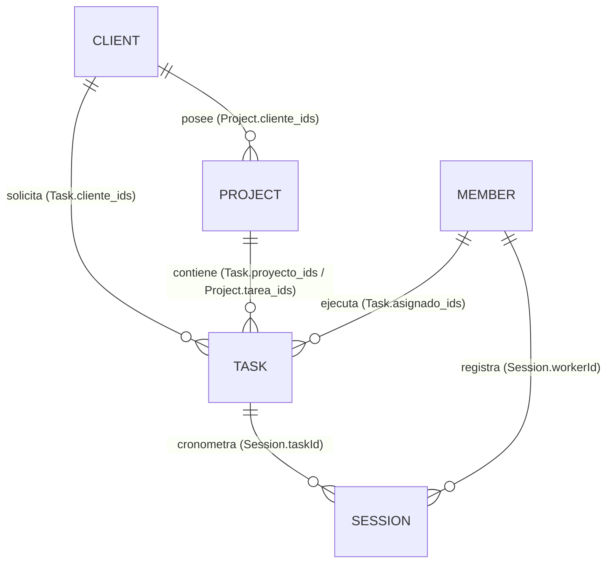

# Arquitectura y Modelo de Datos de Taski (Firestore Native)

> **Nota para la IA y Desarrolladores**: Este documento es la fuente de verdad oficial del modelo de datos de Taski. **Todas las lecturas, escrituras, hooks y componentes operan de forma nativa sobre Firebase Firestore.**

---

## 1. Arquitectura General (Single Source of Truth)

Taski opera al 100% sobre **Google Cloud Firestore**. Se ha eliminado por completo cualquier dependencia con servidores intermediarios (Python/Notion).

### Colecciones Nativas de Firestore

| Colección | Identificador Documento | Propósito | Hook Principal |
| :--- | :--- | :--- | :--- |
| **`clients`** | `String` (ej. `"1"`, `"cli-178...`) | Directorio de marcas y clientes corporativos | `useClients()` |
| **`members`** | `String` (ej. `"1"`, `"mem-178...`) | Directorio de colaboradores y talento del equipo | `useMembers()` |
| **`projects`** | `String` (ej. `"1"`, `"proj-178...`) | Campañas, desarrollos web y proyectos agrupados | `useData()`, `useProjectSummary()` |
| **`tasks`** | `String` (ej. `"1"`, `"task-178...`) | Entregables atómicos de diseño, video, código y copia | `useData()` |
| **`sessions`** | `String` (ej. `"sess-178...`) | Registro de sesiones de tiempo reales (Maker Mode) | `useSessions()` |

---

## 2. Diagrama de Relaciones de Entidades

---

## 3. Matriz de Sincronización entre Componentes

| Colección | Propiedades Reactivas | Componentes que la Consumen | Efecto Visual / Lógica |
| :--- | :--- | :--- | :--- |
| **`clients`** | • `nombre` • `color` / `customColor` • `finanzas` • `status` • `industria` | • `ClientsDashboard.tsx` • `ClientCard.tsx` • `ProjectFullScreenView.tsx` • `EntityDetailView.tsx` • `FinanzasGlobalesDashboard.tsx` | 1. Refleja el color HSL corporativo en la portada. 2. Llena el popover de clientes en proyectos y tareas. 3. Alimenta los KPIs de Valor de Cartera y Facturación. 4. Renderiza logos/avatares en las tarjetas de colaboradores asignados. |
| **`members`** | • `nombre` • `rol` / `specialty` • `color` • `skills` • `proyectos_asignados` • `disponibilidad` | • `TeamDashboard.tsx` • `MemberCard.tsx` • `ProjectFullScreenView.tsx` • `TaskCard.tsx` • `EntityDetailView.tsx` | 1. Llena el popover de asignados (`A` pill) en proyectos. 2. Calcula % de Carga Laboral y tareas asignadas. 3. Muestra las marcas vinculadas en la esquina inferior derecha. 4. Genera catálogo de formas vectoriales de su especialidad. |
| **`projects`** | • `nombre` • `color` • `cliente_ids` • `asignado_ids` • `estadoProyecto` • `costo` • `fechaInicio` / `fechaFin` | • `ProjectDashboard.tsx` • `ProjectCard.tsx` • `ProjectFullScreenView.tsx` • `EntityProjectsKanban.tsx` | 1. Vincula el proyecto al cliente y acumula valor financiero. 2. Actualiza la barra de progreso segmentada (`Tarea X de Y`). 3. Al cambiar de estado, se mueve en tiempo real en los tableros Kanban. 4. Sincroniza fechas en el calendario. |
| **`tasks`** | • `titulo` • `formato` • `esfuerzo` • `estado` • `proyecto_ids` • `cliente_ids` • `asignado_ids` | • `KanbanBoard.tsx` • `TaskCard.tsx` • `TaskModal.tsx` • `ProjectCoverFormats.tsx` | 1. Dibuja los iconos vectoriales de formato en las portadas de proyectos y colaboradores. 2. Al marcar una tarea como *"Completado"*, avanza el progreso del proyecto. 3. Reevalúa automáticamente el estado del proyecto. |
| **`sessions`** | • `startTime` • `endTime` • `durationSeconds` • `taskId` • `projectId` • `workerId` | • `useSessions.ts` • `EntityFinancesInsights.tsx` • `TaskCardSessions.tsx` | 1. Acumula horas reales invertidas por colaborador y cliente. 2. Permite auditoría de rentabilidad en finanzas. |

---

## 4. Estándar de Colores e Identidad Visual (Single Source of Truth)

1. **Resolución de Colores**:
   - `getSingleSourceClientColor(client)` $\rightarrow$ resuelve `{ hslCss, hex, colorName }` de la marca.
   - `getSingleSourceProjectColor(project)` $\rightarrow$ resuelve `{ hslCss, hex, colorName }` del proyecto.
2. **Prioridad de Respaldo**:
   1. `entity.customColor` (`{ h, s, l }`).
   2. `entity.color` (string CSS directo `hsl(...)` o `hex`).
   3. `entity.colorName` (coincidencia en `PROJECT_COLOR_PALETTE`).
   4. Fallback por Hash determinista sobre el nombre (`hashStringToHue`).

---

## 5. Estándar Universal de Timestamps (`createdAt` y `updatedAt`)

Todas las entidades y colecciones (`clients`, `members`, `projects`, `tasks`, `sessions`) manejan timestamps de Firestore para trazabilidad, ordenamiento reactivo y auditoría:

| Propiedad | Tipo | Generación | Utilidad Principal |
| :--- | :--- | :--- | :--- |
| `createdAt` / `created_at` | `FieldValue` (`serverTimestamp()`) \| `Timestamp` | Asignado automáticamente al crear el documento | Ordenamiento de dashboards por *"Más recientes"*, onboarding y auditoría |
| `updatedAt` / `updated_at` | `FieldValue` (`serverTimestamp()`) \| `Timestamp` | Actualizado automáticamente en cada mutación | Disparador de alertas, detección de desincronización y caché reactivo |
